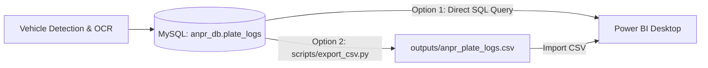

# Automatic Number Plate Recognition (ANPR) - Power BI Analytics & Dashboard Guide

This guide provides a comprehensive, step-by-step walkthrough to build an executive **Traffic & ANPR Surveillance Analytics Dashboard** in Power BI using either direct MySQL queries or the enriched CSV dataset.

---

## 1. Architecture & Data Ingestion Options



### Option A: Connecting Directly to MySQL via SQL Query (Recommended for Live Data)
In Power BI Desktop:
1. Click **Get Data** -> **MySQL Database**.
2. **Server**: `localhost:3306` (or your MySQL host).
3. **Database**: `anpr_db`.
4. Click **Advanced options** and paste the SQL query from `anpr_db.sql`:

```sql
SELECT 
    id,
    plate_number,
    confidence,
    ROUND(confidence * 100, 1) AS confidence_pct,
    timestamp,
    DATE(timestamp) AS log_date,
    TIME(timestamp) AS log_time,
    HOUR(timestamp) AS log_hour,
    DAYNAME(timestamp) AS day_of_week,
    CASE 
        WHEN plate_number IN ('DL 3C AB 9012', 'MH 04 AB 0001', 'GENMERCANLAR') THEN 'Flagged'
        WHEN plate_number LIKE '%KA%' OR plate_number LIKE '%MH%' OR plate_number LIKE '%TN%' THEN 'Authorized'
        ELSE 'Visitor'
    END AS vehicle_status,
    CASE 
        WHEN id % 2 = 0 THEN 'Gate 01'
        ELSE 'Gate 02'
    END AS gate_id,
    CASE 
        WHEN confidence >= 0.95 THEN '>95% High'
        WHEN confidence >= 0.85 THEN '85-95% Medium'
        ELSE '<85% Low'
    END AS confidence_bracket
FROM anpr_db.plate_logs;
```

### Option B: Importing Enriched CSV (Ready-to-Use 17 Dimensions)
1. In Power BI Desktop, click **Get Data** -> **Text/CSV**.
2. Select `outputs/anpr_plate_logs.csv` from this project folder.
3. Click **Load**.

---

## 2. Generating & Refreshing Data

- **Run Live Pipeline on Images/Videos**:
  ```powershell
  python scripts/detect_and_log.py test_car.jpg
  ```
- **Seed 500 to 5,000+ Realistic Traffic Logs**:
  ```powershell
  # Seed 500 records into MySQL and update CSV
  python scripts/seed_database.py --count 500

  # Clear and regenerate 1,000 fresh records
  python scripts/seed_database.py --count 1000 --clear
  ```
- **Export CSV Manually**:
  ```powershell
  python scripts/export_csv.py
  ```

---

## 3. Dataset Schema & Available Fields

| Field Name | Type | Analytical & Dashboard Use |
| :--- | :--- | :--- |
| `id` | Integer | Transaction ID |
| `plate_number` | Text | Recognized license plate string |
| `confidence` | Decimal | Raw OCR score (0.0 to 1.0) |
| `confidence_pct` / `confidence_percent` | Decimal | Readable percentage (e.g., `98.5%`) |
| `confidence_bracket` | Categorical | `>95% High`, `85-95% Medium`, `<85% Low` |
| `timestamp` | DateTime | Full detection timestamp |
| `log_date` / `date` | Date | Calendar timeline filtering |
| `log_time` / `time` | Time | Detection time |
| `log_hour` / `hour` | Integer (0–23) | Hourly traffic density and peak analysis |
| `day_of_week` / `day_name` | Categorical | `Monday` to `Sunday` volume comparisons |
| `day_type` | Categorical | `Weekday` vs `Weekend` |
| `traffic_period` | Categorical | `Morning Rush`, `Afternoon`, `Evening Rush`, `Night` |
| `vehicle_status` | Categorical | Security classification: `Authorized`, `Visitor`, `Flagged` |
| `gate_id` | Categorical | Entry/Exit point: `Gate 01`, `Gate 02` |
| `state_code` / `state_name` | Categorical | Geographic region (`Tamil Nadu`, `Maharashtra`, `Delhi`, etc.) |

---

## 4. Key DAX Measures for Power BI

Create a dedicated measures table or add these measures under the modeling tab:

```dax
// 1. Total Volume
Total Detections = COUNTROWS(anpr_plate_logs)

// 2. Unique Vehicle Count
Unique Vehicles = DISTINCTCOUNT(anpr_plate_logs[plate_number])

// 3. Average Recognition Accuracy
Avg OCR Accuracy % = AVERAGE(anpr_plate_logs[confidence_percent])

// 4. Security: Flagged Vehicles Count
Flagged Vehicles = CALCULATE([Total Detections], anpr_plate_logs[vehicle_status] = "Flagged")

// 5. Authorized Vehicles Rate %
Authorized Rate % = 
DIVIDE(
    CALCULATE([Total Detections], anpr_plate_logs[vehicle_status] = "Authorized"),
    [Total Detections],
    0
) * 100

// 6. Repeat Visitor Count
Repeat Visits = [Total Detections] - [Unique Vehicles]

// 7. Repeat Visitor Rate %
Repeat Visitor Rate % = DIVIDE([Repeat Visits], [Total Detections], 0) * 100
```

---

## 5. Dashboard Layout & Visuals Blueprint

```
+---------------------------------------------------------------------------------------------------+
|  [SLICERS]: Date Range Slicer | Gate ID Filter | Vehicle Status (Auth/Visitor/Flagged) | State    |
+---------------------------------------------------------------------------------------------------+
|  [KPI CARD 1]          |  [KPI CARD 2]         |  [KPI CARD 3]         |  [KPI CARD 4]            |
|  Total Detections      |  Unique Vehicles      |  Flagged Vehicles     |  Avg OCR Accuracy %      |
|  516                   |  142                  |  18                   |  94.2%                   |
+---------------------------------------------------------------------------------------------------+
|  [VISUAL 1: COLUMN CHART]                      |  [VISUAL 2: DONUT CHART]                         |
|  Peak Traffic Hours (Hour 0-23 vs Total Count) |  Vehicle Status (Authorized vs Visitor vs Flagged)|
+---------------------------------------------------------------------------------------------------+
|  [VISUAL 3: BAR CHART]                         |  [VISUAL 4: DONUT CHART]                         |
|  Gate Utilization (Gate 01 vs Gate 02)         |  Confidence Bracket (>95% High / Medium / Low)   |
+---------------------------------------------------------------------------------------------------+
|  [VISUAL 5: SURVEILLANCE & FREQUENCY TABLE]                                                       |
|  Plate Number | State | Status | Gate ID | Total Visits | Avg Accuracy % | Last Seen Timestamp|
+---------------------------------------------------------------------------------------------------+
```

### Visual Configuration Details:
1. **Peak Traffic Density (Clustered Column Chart)**:
   - **X-Axis**: `log_hour` (0 to 23)
   - **Y-Axis**: `[Total Detections]`
   - **Color / Legend**: `vehicle_status` or `traffic_period`
2. **Security & Access Distribution (Donut Chart)**:
   - **Legend**: `vehicle_status` (`Authorized`, `Visitor`, `Flagged`)
   - **Values**: `[Total Detections]`
3. **Gate Activity Comparison (Clustered Bar Chart)**:
   - **Y-Axis**: `gate_id`
   - **X-Axis**: `[Total Detections]`
4. **Accuracy Quality Assurance (Donut Chart)**:
   - **Legend**: `confidence_bracket` (`>95% High`, `85-95% Medium`, `<85% Low`)
   - **Values**: `[Total Detections]`
5. **Surveillance & Repeat Frequency Leaderboard (Table Visual)**:
   - **Columns**: `plate_number`, `state_name`, `vehicle_status`, `gate_id`, `Count of id` (Total Visits), `Avg of confidence_percent`, `Max of timestamp` (Last Seen).
   - **Conditional Formatting**: Highlight rows with `vehicle_status = 'Flagged'` in soft red.

---

## 6. Real-Time Refreshing
- Whenever the ANPR pipeline processes new video feeds or images (`python scripts/detect_and_log.py <media>`), open Power BI and click **Refresh** on the Home ribbon. All KPIs and charts update in real time.
