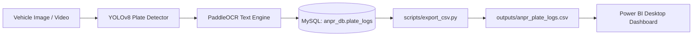

# Automatic Number Plate Recognition (ANPR) - Power BI Analytics & Dashboard Guide

This guide provides step-by-step instructions to build a production-ready, interactive **Traffic & ANPR Surveillance Analytics Dashboard** in Power BI using the data generated by the ANPR pipeline.

---

## 1. Architecture & Data Flow



---

## 2. Generating & Refreshing the Dataset

You can populate the dataset using real camera detections or generate high-volume realistic traffic logs:

### A. Live Video / Image Detection
```powershell
# Run detection and log real plates to MySQL
python scripts/detect_and_log.py test_car.jpg
```

### B. Generate Realistic Traffic Datasets (500 to 5,000+ Records)
Use the included seeder to generate realistic rush-hour distributions, regional plates, and confidence variations:
```powershell
# Generate 500 records into MySQL and auto-export enriched CSV
python scripts/seed_database.py --count 500

# Clear old test records and seed 1,000 fresh records
python scripts/seed_database.py --count 1000 --clear
```

### C. Manual CSV Export
```powershell
python scripts/export_csv.py
```
This writes the enriched dataset to `outputs/anpr_plate_logs.csv`.

---

## 3. Dataset Schema & Enriched Dimensions

The exporter transforms raw database logs into 14 analytical fields ready for Power BI:

| Field | Data Type | Analytical Purpose |
| :--- | :--- | :--- |
| `id` | Integer | Unique detection transaction ID |
| `plate_number` | Text | Recognized registration number (e.g. `TN07CD4512`, `MH12AB1001`) |
| `confidence` | Decimal (0–1) | Raw OCR accuracy score |
| `confidence_percent`| Decimal (0–100)| Human-readable percentage (e.g., `99.85%`) |
| `confidence_tier` | Categorical | `High (>=90%)`, `Moderate (75-89%)`, `Low (<75%)` |
| `timestamp` | DateTime | Full detection timestamp |
| `date` | Date | Date dimension for calendar filtering |
| `time` | Time | Detection time (HH:MM:SS) |
| `hour` | Integer (0–23) | Hour of the day for hourly traffic density |
| `day_name` | Categorical | `Monday` through `Sunday` |
| `day_type` | Categorical | `Weekday` vs `Weekend` |
| `traffic_period` | Categorical | `Morning Rush (06:00 - 11:00)`, `Afternoon (11:00 - 16:00)`, `Evening Rush (16:00 - 21:00)`, `Night (21:00 - 06:00)` |
| `state_code` | Categorical | 2-letter state prefix (e.g., `TN`, `MH`, `DL`, `KA`, `HR`) |
| `state_name` | Categorical | Full region name (e.g., `Tamil Nadu`, `Maharashtra`, `Delhi`) |

---

## 4. Step-by-Step Power BI Setup

### Step 1: Import Data into Power BI Desktop
1. Open **Power BI Desktop**.
2. Click **Get Data** -> **Text/CSV**.
3. Browse and select `outputs/anpr_plate_logs.csv` from this project directory.
4. Click **Load**.

---

### Step 2: Create Recommended DAX Measures
Click **New Measure** in the Modeling tab and create the following key performance indicators:

#### 1. Total Detections
```dax
Total Detections = COUNTROWS(anpr_plate_logs)
```

#### 2. Unique Vehicles
```dax
Unique Vehicles = DISTINCTCOUNT(anpr_plate_logs[plate_number])
```

#### 3. Average OCR Accuracy
```dax
Avg OCR Accuracy % = AVERAGE(anpr_plate_logs[confidence_percent])
```

#### 4. Repeat Visitors
```dax
Repeat Visitors = [Total Detections] - [Unique Vehicles]
```

#### 5. Repeat Visitor Rate %
```dax
Repeat Visitor Rate % = 
DIVIDE([Repeat Visitors], [Total Detections], 0) * 100
```

#### 6. High Accuracy Rate %
```dax
High Accuracy Rate % = 
DIVIDE(
    CALCULATE([Total Detections], anpr_plate_logs[confidence_tier] = "High (>=90%)"),
    [Total Detections],
    0
) * 100
```

---

## 5. Recommended Visuals & Dashboard Layout

### 🔹 Top Row: Executive KPI Cards
Create 4 **Card Visuals** across the top of the canvas:
1. **Total Vehicles Detected**: `[Total Detections]`
2. **Unique Vehicles**: `[Unique Vehicles]`
3. **Repeat Rate**: `[Repeat Visitor Rate %]` (Format as `0.0%`)
4. **Average OCR Accuracy**: `[Avg OCR Accuracy %]` (Format as `0.0%`)

---

### 🔹 Middle Row: Temporal & Traffic Volume Analytics
1. **Peak Traffic Density (Clustered Column or Area Chart)**
   - **X-Axis**: `hour` (0 to 23)
   - **Y-Axis**: `[Total Detections]`
   - **Tooltip**: `traffic_period`
   - *Insight*: Shows exact morning (8–10 AM) and evening (5–8 PM) rush hour congestion peaks.

2. **Traffic Period Distribution (Donut Chart)**
   - **Legend**: `traffic_period`
   - **Values**: `[Total Detections]`
   - *Insight*: Compares Morning Rush vs Afternoon vs Evening Rush vs Night volume.

3. **Weekday vs Weekend Volume (Stacked Column Chart)**
   - **X-Axis**: `day_name` (Ordered Mon -> Sun)
   - **Legend**: `day_type`
   - **Y-Axis**: `[Total Detections]`

---

### 🔹 Bottom Row: Quality Control & Vehicle Origin Analytics
1. **Regional Vehicle Origins (Horizontal Bar Chart or Treemap)**
   - **Y-Axis**: `state_name`
   - **X-Axis**: `[Total Detections]`
   - *Insight*: Identifies where inbound/outbound vehicles are registered.

2. **OCR Confidence Quality Tier (Pie / Donut Chart)**
   - **Legend**: `confidence_tier`
   - **Values**: `[Total Detections]`
   - *Insight*: Visualizes high-confidence automated reads vs plates requiring manual review.

3. **Vehicle Surveillance & Frequency Leaderboard (Table Visual)**
   - **Columns**:
     - `plate_number`
     - `state_name`
     - `Count of id` (Rename visual field to: *Total Visits*)
     - `Average of confidence_percent` (Rename to: *Avg Confidence %*)
     - `Max of timestamp` (Rename to: *Last Seen Time*)
   - *Sort*: By *Total Visits* Descending.

---

### 🔹 Top Slicers / Interactive Filters
Place dynamic filter dropdowns at the top right of the dashboard:
- **Date Range Slicer**: `date` (Between slider)
- **State Filter**: `state_name` (Dropdown)
- **Traffic Slot Filter**: `traffic_period` (Buttons/Tile)
- **Quality Filter**: `confidence_tier` (Buttons/Tile)

---

## 6. Keeping the Dashboard in Sync with Live Data
When new plates are recognized:
1. Run `python scripts/detect_and_log.py <path_to_image_or_video>`.
2. Open Power BI Desktop and click the **Refresh** button in the Home ribbon to update all charts instantly.
